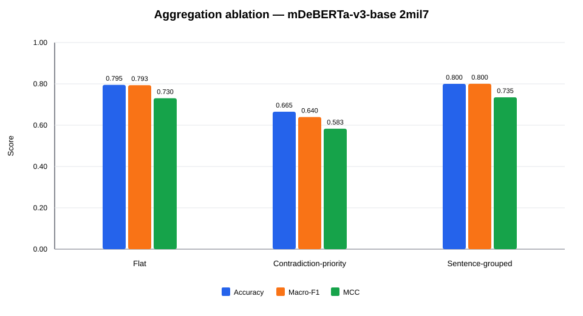
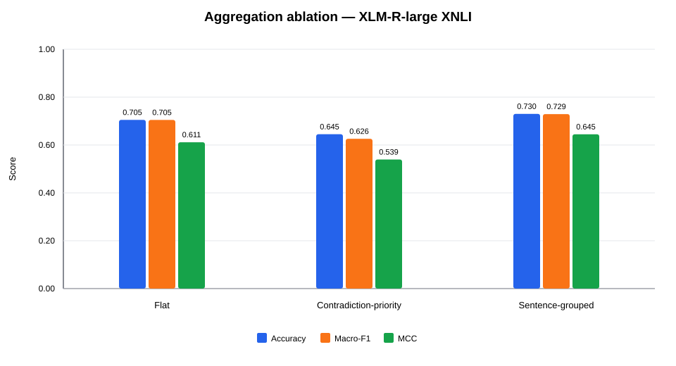

# K2 aggregation ablation on the assistant-assisted atom pilot v1.1

**Experiment ID:** `K2-AGG-ABLATION-ASSISTED-PILOT-v1.1`  
**Status:** exploratory ablation  
**Stage:** aggregation policy selection  

## Research question

When frozen atom-level NLI decisions are reused, how do flat, contradiction-priority, and sentence-grouped deterministic aggregation rules affect four-class claim classification?

## Rules

- **Flat:** all-entailment → supported; otherwise any entailment → partially_supported; otherwise any contradiction → contradicted; otherwise unverifiable.
- **Contradiction-priority:** all-entailment → supported; otherwise any contradiction → contradicted; otherwise any entailment → partially_supported; otherwise unverifiable.
- **Sentence-grouped:** atoms are automatically aligned to the claim sentence from which they were derived. Contradiction dominates within a sentence; sentence outcomes are then combined across the claim.

No NLI inference was repeated. All rules reuse the frozen atom decisions from the v1.1 source runs.

## Main results

| Model | Rule | Accuracy | Macro-F1 | Δ vs flat | MCC | Changed claims |
| --- | --- | --- | --- | --- | --- | --- |
| mDeBERTa-v3-base 2mil7 | Flat | 0.7950 | 0.7935 | +0.0000 | 0.7302 | 0 |
| mDeBERTa-v3-base 2mil7 | Contradiction-priority | 0.6650 | 0.6395 | -0.1540 | 0.5830 | 48 |
| mDeBERTa-v3-base 2mil7 | Sentence-grouped | 0.8000 | 0.8004 | +0.0069 | 0.7350 | 15 |
| XLM-R-large XNLI | Flat | 0.7050 | 0.7048 | +0.0000 | 0.6114 | 0 |
| XLM-R-large XNLI | Contradiction-priority | 0.6450 | 0.6259 | -0.0788 | 0.5394 | 26 |
| XLM-R-large XNLI | Sentence-grouped | 0.7300 | 0.7292 | +0.0244 | 0.6448 | 7 |

The highest exploratory Macro-F1 is **0.8004** from **mDeBERTa-v3-base 2mil7 / Sentence-grouped**.

### mDeBERTa-v3-base 2mil7



### XLM-R-large XNLI



## Policy-review sensitivity

The two pre-identified policy-review examples are: `finance_test_0158`, `medical_test_0185`.

| Model | Rule | Macro-F1 all | Macro-F1 excluding review | Difference |
| --- | --- | --- | --- | --- |
| mDeBERTa-v3-base 2mil7 | Flat | 0.7935 | 0.8013 | +0.0078 |
| mDeBERTa-v3-base 2mil7 | Contradiction-priority | 0.6395 | 0.6367 | -0.0028 |
| mDeBERTa-v3-base 2mil7 | Sentence-grouped | 0.8004 | 0.8033 | +0.0028 |
| XLM-R-large XNLI | Flat | 0.7048 | 0.7122 | +0.0074 |
| XLM-R-large XNLI | Contradiction-priority | 0.6259 | 0.6232 | -0.0027 |
| XLM-R-large XNLI | Sentence-grouped | 0.7292 | 0.7321 | +0.0029 |

## Paired tests against flat

| Model | Alternative | Flat-only correct | Alternative-only correct | Discordant | Exact p |
| --- | --- | --- | --- | --- | --- |
| mDeBERTa-v3-base 2mil7 | Contradiction-priority | 35 | 9 | 44 | 0.0001 |
| mDeBERTa-v3-base 2mil7 | Sentence-grouped | 6 | 7 | 13 | 1.0000 |
| XLM-R-large XNLI | Contradiction-priority | 19 | 7 | 26 | 0.0290 |
| XLM-R-large XNLI | Sentence-grouped | 1 | 6 | 7 | 0.1250 |

McNemar tests are exploratory because the same pilot data informed the error analysis and policy hypotheses.

## Interpretation

- Flat is the frozen K2 pilot baseline and preserves the original aggregation policy.
- Contradiction-priority tests whether any contradicted atom should dominate the full claim decision.
- Sentence-grouped aggregation tests a structural compromise: contradiction dominates only within the source sentence, while supported and contradicted sentences can still yield a partially_supported claim.
- Results excluding the two pre-identified gold_or_policy_review examples are reported as a sensitivity analysis rather than as the primary score.

## Limitations

- This is a post-hoc exploratory ablation on the same 200-claim pilot used for error analysis; it must not be treated as final policy selection evidence.
- Sentence grouping is inferred automatically from lexical overlap with claim sentences and is not human-annotated discourse structure.
- The atom set remains assistant-assisted and provisional rather than human-adjudicated gold.
- Hard atom labels are reused; probability-aware aggregation and calibrated thresholds are outside this experiment.

## Next steps

- Select a provisional aggregation policy using performance, error direction, and annotation-policy consistency rather than Macro-F1 alone.
- Human-adjudicate the two policy-review examples before freezing the aggregation definition.
- Validate the chosen rule on a separate calibration or internal evaluation split.
- Keep flat aggregation as the primary baseline even if an alternative rule is selected.

## Reproducibility

```powershell
C:\Python314\python.exe scripts\55_run_aggregation_ablation.py --config "configs\\experiments\\K2-AGG-ABLATION-ASSISTED-PILOT-v1.1.json"
```

Source runs:

- `runs/K2-ATOM-ASSISTED-ZS-PILOT-v1.1__mdeberta_base_2mil7`
- `runs/K2-ATOM-ASSISTED-ZS-PILOT-v1.1__xlmr_large_xnli`

Generated artifacts:

- `tables/aggregation_metrics.csv`
- `tables/class_metrics.csv`
- `tables/changed_predictions.csv`
- `tables/mcnemar_tests.csv`
- one confusion-matrix CSV and SVG per model/rule
- one derived prediction JSONL and metrics JSON per model/rule
- one aggregation-comparison SVG per model
