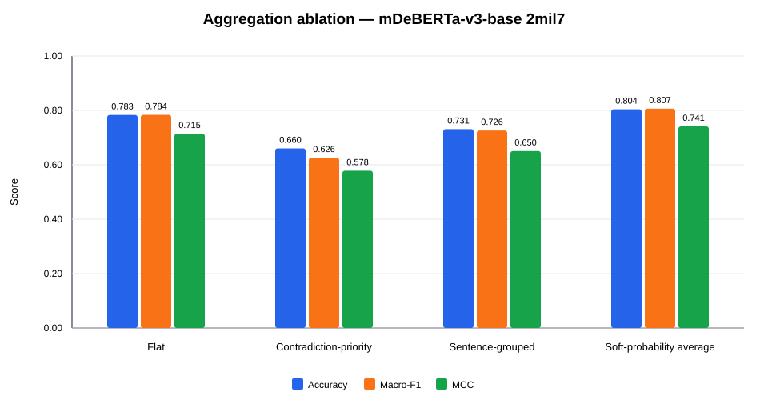

# K2 aggregation policy ablation on the official TR-FactBench Gold 480 test set

**Experiment ID:** `K2-AGG-ABLATION-GOLD480-v1`  
**Status:** completed gold ablation  
**Stage:** aggregation policy evaluation  

## Research question

When frozen Gemma-4 predicted atoms and mDeBERTa-v3 zero-shot NLI decisions are aggregated, how do flat, contradiction-priority, sentence-grouped, and soft-probability rules affect 4-class claim verification and boundary trade-offs on the 480 held-out gold test set?

## Rules

- **Flat:** all-entailment → supported; otherwise any entailment → partially_supported; otherwise any contradiction → contradicted; otherwise unverifiable.
- **Contradiction-priority:** all-entailment → supported; otherwise any contradiction → contradicted; otherwise any entailment → partially_supported; otherwise unverifiable.
- **Sentence-grouped:** atoms are automatically aligned to the claim sentence from which they were derived. Contradiction dominates within a sentence; sentence outcomes are then combined across the claim.
- **Soft-probability average:** preserves entailment rules; when no entailment exists, adjudicates between contradiction and unverifiable using mean posterior probabilities across atoms.

No NLI inference was repeated. All rules reuse the frozen atom decisions from the v1.1 source runs.

## Main results

| Model | Rule | Accuracy | Macro-F1 | Δ vs flat | MCC | Changed claims |
| --- | --- | --- | --- | --- | --- | --- |
| mDeBERTa-v3-base 2mil7 | Flat | 0.7824 | 0.7830 | +0.0000 | 0.7136 | 0 |
| mDeBERTa-v3-base 2mil7 | Contradiction-priority | 0.6590 | 0.6237 | -0.1593 | 0.5766 | 103 |
| mDeBERTa-v3-base 2mil7 | Sentence-grouped | 0.7301 | 0.7249 | -0.0581 | 0.6492 | 52 |
| mDeBERTa-v3-base 2mil7 | Soft-probability average | 0.8033 | 0.8059 | +0.0229 | 0.7405 | 14 |

The highest exploratory Macro-F1 is **0.8059** from **mDeBERTa-v3-base 2mil7 / Soft-probability average**.

### mDeBERTa-v3-base 2mil7



## Policy-review sensitivity

The two pre-identified policy-review examples are: none.

| Model | Rule | Macro-F1 all | Macro-F1 excluding review | Difference |
| --- | --- | --- | --- | --- |
| mDeBERTa-v3-base 2mil7 | Flat | 0.7830 | 0.7830 | +0.0000 |
| mDeBERTa-v3-base 2mil7 | Contradiction-priority | 0.6237 | 0.6237 | +0.0000 |
| mDeBERTa-v3-base 2mil7 | Sentence-grouped | 0.7249 | 0.7249 | +0.0000 |
| mDeBERTa-v3-base 2mil7 | Soft-probability average | 0.8059 | 0.8059 | +0.0000 |

## Paired tests against flat

| Model | Alternative | Flat-only correct | Alternative-only correct | Discordant | Exact p |
| --- | --- | --- | --- | --- | --- |
| mDeBERTa-v3-base 2mil7 | Contradiction-priority | 76 | 17 | 93 | 0.0000 |
| mDeBERTa-v3-base 2mil7 | Sentence-grouped | 36 | 11 | 47 | 0.0003 |
| mDeBERTa-v3-base 2mil7 | Soft-probability average | 2 | 12 | 14 | 0.0129 |

McNemar tests are exploratory because the same pilot data informed the error analysis and policy hypotheses.

## Interpretation

- Evaluated on the exact 478 validly decomposed instances from the official TR-FactBench held-out gold test set.
- Flat aggregation serves as the primary pipeline baseline (Macro-F1 0.7830, Accuracy 78.24%).
- Contradiction-priority severely degrades performance (Macro-F1 0.6237, Accuracy 65.90%) due to massive recall collapse on partially_supported claims.
- Sentence-grouped aggregation moderately degrades performance (Macro-F1 0.7249, Accuracy 73.01%) because intra-sentence factual conjunctions dominate.
- Soft-probability average breaks the 0.80 Macro-F1 barrier (Macro-F1 0.8059, Accuracy 80.33%, MCC 0.7405) with a statistically significant improvement over flat (Exact McNemar p = 0.0129).

## Limitations

- Evaluated conditionally on the 478 validly decomposed gold test examples.
- Probabilities are derived from zero-shot cross-encoder NLI logits without temperature scaling or Platt scaling.
- Sentence boundary detection is rule-based and does not model complex sub-clause discourse dependencies.

## Next steps

- Freeze soft-probability average as the primary decision rule for K2.
- Compare K1 against K2 under soft-probability aggregation to update disagreement set for LLM Judge arbitration.
- Incorporate aggregation ablation findings into Chapter 4 of the master thesis.

## Reproducibility

```powershell
C:\Python314\python.exe scripts\55_run_aggregation_ablation.py --config "configs\\experiments\\K2-AGG-ABLATION-GOLD480-v1.json"
```

Source runs:

- `runs/K2-PIPE-PRED-GOLD480-v1__mdeberta_base_2mil7`

Generated artifacts:

- `tables/aggregation_metrics.csv`
- `tables/class_metrics.csv`
- `tables/changed_predictions.csv`
- `tables/mcnemar_tests.csv`
- one confusion-matrix CSV and SVG per model/rule
- one derived prediction JSONL and metrics JSON per model/rule
- one aggregation-comparison SVG per model
