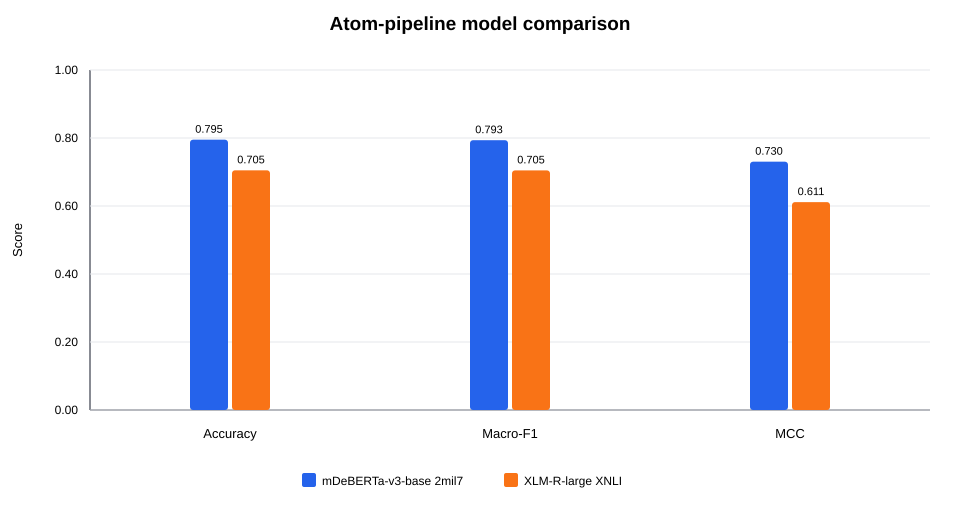
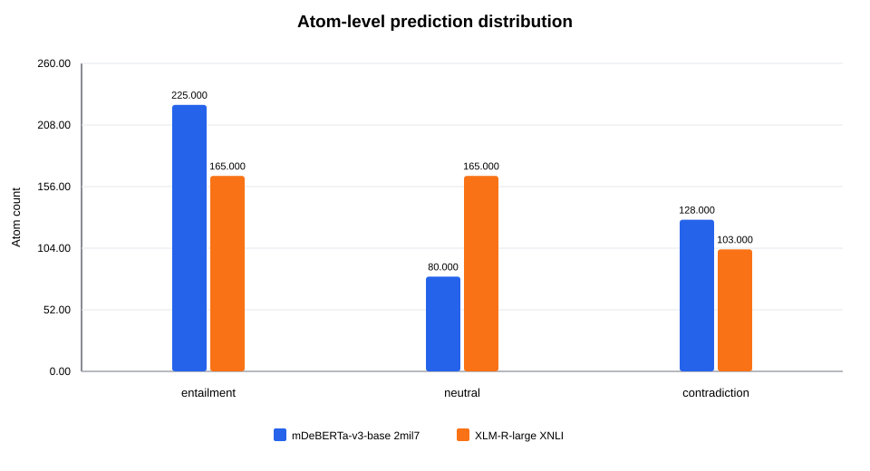
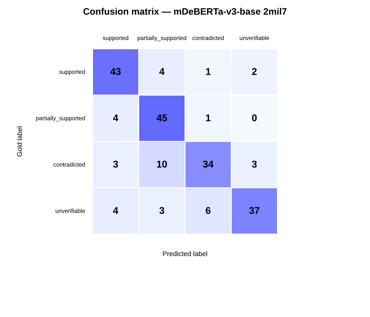
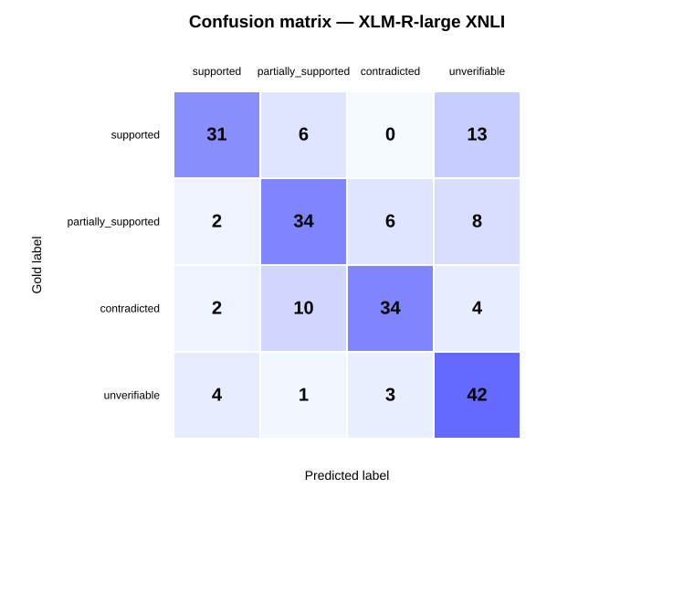

# K2 assistant-assisted atom-level zero-shot NLI pilot v1.1

**Experiment ID:** `K2-ATOM-ASSISTED-ZS-PILOT-v1.1`  
**Status:** frozen pilot  
**Stage:** model comparison and atomization verification  
**Dataset:** `data/processed/atom_level/assistant_draft_v1_1/k2_atomization_assistant_pilot_v1.1_with_context.jsonl`  

## Research question

How accurately do multilingual zero-shot NLI verifiers classify assistant-generated Turkish claim atoms, and how do atom-level decisions propagate to the four claim labels under deterministic flat aggregation?

## Experimental setup

- Claims: **200**
- Atoms: **433**
- Mean atoms per claim: **2.1650**
- Claim labels: supported, partially_supported, contradicted, unverifiable
- Aggregation: flat deterministic aggregation over hard atom labels
- Atomization status counts: `{"approved": 19, "assistant_revised_high": 1, "assistant_draft_high": 169, "needs_review": 1, "assistant_draft_medium": 10}`

## Main results

| Model | Accuracy | Macro-F1 | MCC | Truncated pairs | Pairs/s |
| --- | --- | --- | --- | --- | --- |
| mDeBERTa-v3-base 2mil7 | 0.7950 | 0.7935 | 0.7302 | 14 | 36.81 |
| XLM-R-large XNLI | 0.7050 | 0.7048 | 0.6114 | 4 | 19.11 |

The best model is **mDeBERTa-v3-base 2mil7** with Macro-F1 **0.7935**. Its Macro-F1 advantage over XLM-R-large XNLI is **0.0887**.



## Class-level F1

| Label | mDeBERTa-v3-base 2mil7 | XLM-R-large XNLI |
| --- | --- | --- |
| supported | 0.8269 | 0.6966 |
| partially_supported | 0.8036 | 0.6733 |
| contradicted | 0.7391 | 0.7312 |
| unverifiable | 0.8043 | 0.7179 |

## Atom decision distribution



The atom-label distribution should be interpreted together with claim-level errors. A model that produces substantially more `neutral` decisions can inflate the final `unverifiable` class after aggregation.

## Confusion matrices

### mDeBERTa-v3-base 2mil7



### XLM-R-large XNLI



## Interpretation

- The v1.1 atomization revision changed one finance example from five scope-fragmented atoms to two scope-preserving atoms; the total atom count decreased from 436 to 433.
- Both verifiers corrected the targeted claim after the v1.1 atomization change, increasing accuracy by 0.005 and Macro-F1 by approximately 0.005.
- mDeBERTa-v3-base 2mil7 remains the stronger verifier on this pilot. XLM-R-large produces substantially more neutral atom decisions and therefore overpredicts the final unverifiable class.
- Most remaining priority errors were classified as NLI errors rather than atomization errors. Two examples remain flagged for joint gold-label and aggregation-policy review.

## Limitations

- The atom set is assistant-assisted and provisional; it is not a human-adjudicated gold atomization dataset.
- The same 200-claim pilot is used for exploratory comparison, so the reported scores must not be presented as final held-out test performance.
- Fourteen mDeBERTa pairs and four XLM-R pairs were truncated at 512 tokens; evidence retrieval or sliding-window inference has not yet been evaluated.
- The flat aggregation rule can map mixed entailment and contradiction atoms to partially_supported even when the claim-level annotation policy prefers contradicted.

## Next steps

- Run aggregation ablations on the saved atom predictions without repeating model inference: flat, contradiction-priority, and sentence-grouped aggregation.
- Human-review the two gold_or_policy_review examples and a stratified sample of assistant-generated atoms.
- Evaluate evidence selection or sliding-window inference for truncated pairs.
- After policy and atom validation, evaluate the selected verifier on a separate calibration and internal evaluation split.

## Reproducibility

Run directories:

- `runs/K2-ATOM-ASSISTED-ZS-PILOT-v1.1__mdeberta_base_2mil7`
- `runs/K2-ATOM-ASSISTED-ZS-PILOT-v1.1__xlmr_large_xnli`

Run commands reconstructed from each manifest:

### mDeBERTa-v3-base 2mil7

```powershell
python scripts/40_run_k2_from_atoms.py --input "data\processed\atom_level\assistant_draft_v1_1\k2_atomization_assistant_pilot_v1.1_with_context.jsonl" --model "MoritzLaurer/mDeBERTa-v3-base-xnli-multilingual-nli-2mil7" --run-id K2-ATOM-ASSISTED-ZS-PILOT-v1.1__mdeberta_base_2mil7 --runs-dir runs --batch-size 1 --max-length 512 --device cuda
```

### XLM-R-large XNLI

```powershell
python scripts/40_run_k2_from_atoms.py --input "data\processed\atom_level\assistant_draft_v1_1\k2_atomization_assistant_pilot_v1.1_with_context.jsonl" --model "joeddav/xlm-roberta-large-xnli" --run-id K2-ATOM-ASSISTED-ZS-PILOT-v1.1__xlmr_large_xnli --runs-dir runs --batch-size 1 --max-length 512 --device cuda
```

Generated artifacts:

- `tables/model_metrics.csv`
- `tables/class_metrics.csv`
- `tables/claim_level_comparison.csv`
- `tables/comparison_bucket_counts.csv`
- `figures/model_comparison.svg`
- `figures/atom_label_distribution.svg`
- one confusion-matrix CSV and SVG per run
