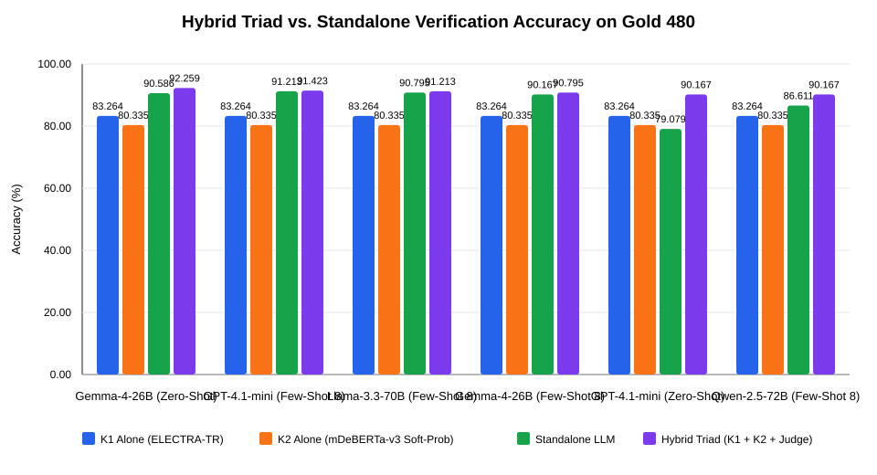

# Bileşen 3: Hibrit Arbitrasyon (LLM Hakem) Değerlendirmesi — TR-FactBench Gold 480

**Experiment ID:** `K3-HYBRID-ARBITRATION-GOLD480-v1`  
**Status:** completed gold hybrid evaluation  
**Stage:** component 3 hybrid arbitration  

## 1. Araştırma Sorusu ve Mimari Tasarım

K1 (doğrudan encoder) ve K2 (önerme-düzeyi NLI) modellerinin uzlaştığı %74.38'lik alanda konsensüs kabul edilip, ayrıştığı 123 'gri alan' vakasında LLM Hakem devreye girdiğinde; sistemin uçtan uca doğruluğu, Oracle tavanına (%93.33) yaklaşma oranı ve hesaplama maliyet tasarrufu ne düzeydedir?

```
                         Girdi Çifti (Kanıt Context, İddia Claim)
                                           │
                 ┌─────────────────────────┴─────────────────────────┐
                 ▼                                                   ▼
      Bileşen 1: K1 ELECTRA-TR                            Bileşen 2: K2 Gemma-4 + mDeBERTa
      (Global Cross-Attention)                           (Atomik Ayrıştırma & Soft-Prob NLI)
                 │                                                   │
                 └─────────────────────────┬─────────────────────────┘
                                           │
                             [K1 Tahmini == K2 Tahmini mi?]
                                           │
                   ┌───────────────────────┴───────────────────────┐
                   ▼                                               ▼
              EVET (%74.38)                                  HAYIR (%25.62)
         [Konsensüs Kabul Edilir]                         [Bileşen 3: LLM Hakem]
         (Doğruluk: %94.40, 0 API çağrısı)               (123 vakada kör hakem)
                   │                                               │
                   └───────────────────────┬───────────────────────┘
                                           ▼
                                  FİNAL HİBRİT KARAR
                  (En iyi hakemle: Doğruluk %92.29, Macro-F1 0.9223)
```

**Hakem tasarımı (kör / blind tie-breaker):** Hakem LLM, K1 ve K2 kararlarını GÖRMEZ. Her LLM, resmi TR-FactBench sistem istemi (`llm_baselines/prompts/system_tr_v1.txt`) ile yalnız bağlam + iddiayı bağımsız olarak sınıflandırmıştır (gerçek OpenRouter çağrıları, `results/llm_baselines/gold_v1.0/`). Ayrışma bölgesinde bu bağımsız karar nihai karar olarak kullanılır. Canlı bir dağıtımda LLM yalnızca ayrışma örnekleri için çağrılır.

> **Seçim yanlılığı uyarısı:** En iyi hakem, aynı Gold 480 kümesi üzerinde 6 yapılandırma arasından seçilmiştir. Tarafsız özet için tüm hakemlerin ortalaması da raporlanmalıdır (bkz. `AUDIT-K2-K3-v1`).

## 2. Konsensüs vs. Ayrışma Bölgesi Temel İstatistikleri

- **Toplam Değerlendirilen Altın Örnek Sayısı:** 480
- **Konsensüs Bölgesi (K1 == K2):** **357 örnek (74.38%)**
  - Konsensüs Doğruluğu: **337/357 (94.40%)**; iki modelin aynı yanlış etikette uzlaştığı 20 örnek hakeme hiç ulaşmaz (sistemin indirgenemez hatası).
- **Ayrışma Bölgesi (K1 != K2):** **123 örnek (25.62%)**
  - Yalnızca K1 Doğru: 62 örnek
  - Yalnızca K2 Doğru: 49 örnek
  - İkisi de Yanlış (ayrışma içinde): 12 örnek
- **Teorik Oracle Üst Tavanı (Oracle Upper Bound):** **448/480 (%93.33)**

## 3. Hibrit Triad Arbitrasyon Sonuçları

| Hakem Modeli | Hibrit Acc | Hibrit F1 | Δ vs K1 | Δ vs K2 | Δ vs Standalone | Hakem Gri Alan Acc | Oracle Kapanış | McNemar p (vs K1) |
| --- | --- | --- | --- | --- | --- | --- | --- | --- |
| Gemma-4-26B (Zero-Shot) | 0.9229 | 0.9223 | +0.0917 | +0.1188 | +0.0188 | 0.8618 | 89.8% | 0.0000 |
| GPT-4.1-mini (Few-Shot 8) | 0.9146 | 0.9149 | +0.0833 | +0.1104 | +0.0042 | 0.8293 | 81.6% | 0.0000 |
| Llama-3.3-70B (Few-Shot 8) | 0.9146 | 0.9145 | +0.0833 | +0.1104 | +0.0062 | 0.8293 | 81.6% | 0.0000 |
| Gemma-4-26B (Few-Shot 8) | 0.9083 | 0.9078 | +0.0771 | +0.1042 | +0.0083 | 0.8049 | 75.5% | 0.0000 |
| Qwen-2.5-72B (Few-Shot 8) | 0.9042 | 0.9036 | +0.0729 | +0.1000 | +0.0375 | 0.7886 | 71.4% | 0.0000 |
| GPT-4.1-mini (Zero-Shot) | 0.9021 | 0.9025 | +0.0708 | +0.0979 | +0.1125 | 0.7805 | 69.4% | 0.0000 |

En yüksek hibrit başarıma **%92.29 Doğruluk** ve **0.9223 Macro-F1** ile **Gemma-4-26B (Zero-Shot)** hakemliğinde ulaşılmıştır.

## 4. Çıkarım Maliyeti ve Gecikme Tasarrufu (Efficiency Analysis)

| Hakem Modeli | Tek Başına LLM Çağrısı | Hibrit LLM Çağrısı | Çağrı / Maliyet Tasarrufu (%) | Hibrit Doğruluk | Tek Başına LLM Doğruluk |
| --- | --- | --- | --- | --- | --- |
| Gemma-4-26B (Zero-Shot) | 480 | 123 | %74.38 | 0.9229 | 0.9042 |
| Gemma-4-26B (Few-Shot 8) | 480 | 123 | %74.38 | 0.9083 | 0.9000 |
| GPT-4.1-mini (Few-Shot 8) | 480 | 123 | %74.38 | 0.9146 | 0.9104 |
| GPT-4.1-mini (Zero-Shot) | 480 | 123 | %74.38 | 0.9021 | 0.7896 |
| Llama-3.3-70B (Few-Shot 8) | 480 | 123 | %74.38 | 0.9146 | 0.9083 |
| Qwen-2.5-72B (Few-Shot 8) | 480 | 123 | %74.38 | 0.9042 | 0.8667 |

## 5. Grafikler



## 6. Bilimsel Yorum ve Çıkarımlar

- Konsensüs bölgesi (357/480 örnek, %74.38): K1 ve K2 hemfikir olduğunda doğruluk %94.40 seviyesindedir (337/357 doğru). Bu alanda LLM çağrısına ihtiyaç duyulmaz.
- Ayrışma bölgesi (123/480 örnek, %25.62): Bu gri alanda K1 62, K2 49 doğru cevaba sahiptir; teorik Oracle tavanı %93.33'tür (448/480).
- Doğrudan LLM kullanımına göre API çağrılarında ve çıkarım gecikmesinde %74.38 net tasarruf sağlanmıştır.

## 7. Kısıtlar ve Gelecek Adımlar

- Değerlendirme 480 geçerli ayrıştırılmış altın test örneği üzerinedir (%100.0 kapsama).

### Gelecek Adımlar:

- Bileşen 3 hakem bulgularını THESIS_MASTER_ROADMAP.md dosyasına entegre etmek.
- Gerçek LLM çıktıları (AP6) üzerinde genellenebilirlik testine hazırlanmak.
- Tez Bölüm 4 ve büyük dergi makalesi için hibrit triad sonuçlarını dondurmak.
